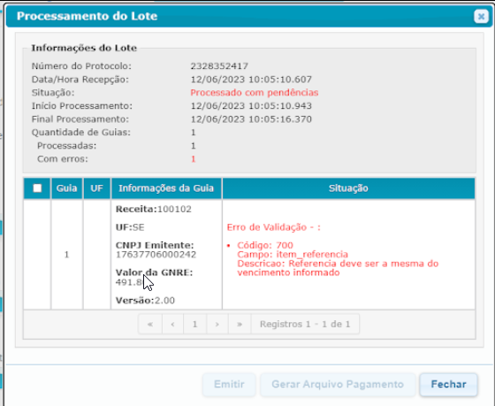

<div align='center'>
 

 
 </div>

# Teste para vaga de Estágio em Analista de Qualidade no Magazord.com.br
Este repositório tem como fim testar os candidatos para vaga de estágio em analista de qualidade na empresa [Magazord](https://magazord.com.br).


## Teste:

Você está encarregado de testar a validação de dados cadastrais em um sistema de gerenciamento de usuários. O sistema possui os seguintes campos de cadastro:

- Nome completo
- E-mail
- Número de telefone
- Data de nascimento
- Endereço (com campos para rua, cidade, estado e CEP)

Houve alterações nos campos mencionados acima no cadastro do cliente, quais testes você faria para validar que o(s) campo(s) esta(ão) funcionando conforme esperado?


**Orientação:** Crie casos de teste para validar a entrada de dados nos campos modificados.


## Desafio:

O cliente enviou o seguinte erro causado pela tentativa de importação de um arquivo XML de GNRE no site https://www.gnre.pe.gov.br:444/gnre/v/lote/processar



Analise o XML exportado e documente o motivo pelo qual o erro está acontecendo.

```
<?xml version="1.0" encoding="UTF-8"?>
<TLote_GNRE xmlns="http://www.gnre.pe.gov.br" versao="2.00">
    <guias>
        <TDadosGNRE versao="2.00">
            <ufFavorecida>SE</ufFavorecida>
            <tipoGnre>0</tipoGnre>
            <contribuinteEmitente>
                <identificacao>
                    <CNPJ>17637*********</CNPJ>
                </identificacao>
                <razaoSocial>Teste Ltda</razaoSocial>
                <endereco>Rua Emilio Paulo Pilz</endereco>
                <municipio>15802</municipio>
                <uf>SC</uf>
                <cep>89280831</cep>
            </contribuinteEmitente>
            <itensGNRE>
                <item>
                    <receita>100102</receita>
                    <documentoOrigem tipo="10">581</documentoOrigem>
                    <referencia>
                        <mes>05</mes>
                        <ano>2023</ano>
                    </referencia>
                    <dataVencimento>2024-01-11</dataVencimento>
                    <valor tipo="11">491.80</valor>
                    <contribuinteDestinatario>
                        <identificacao>
                            <CNPJ>05578765000127</CNPJ>
                        </identificacao>
                        <razaoSocial>QUALITY BRINDES LTDA</razaoSocial>
                        <municipio>00308</municipio>
                    </contribuinteDestinatario>
                    <camposExtras>
                        <campoExtra>
                            <codigo>77</codigo>
                            <valor>42230517637*********55005000000**1000015949</valor>
                        </campoExtra>
                    </camposExtras>
                </item>
            </itensGNRE>
            <valorGNRE>491.80</valorGNRE>
            <dataPagamento>2024-01-11</dataPagamento>
        </TDadosGNRE>
    </guias>
</TLote_GNRE>
```

## Avaliação:

- Os candidatos serão avaliados com base na clareza, precisão e detalhamento das respostas.
- A capacidade de compreender e comunicar efetivamente requisitos e problemas é fundamental.
- A organização e a estrutura das respostas também serão consideradas na avaliação.
