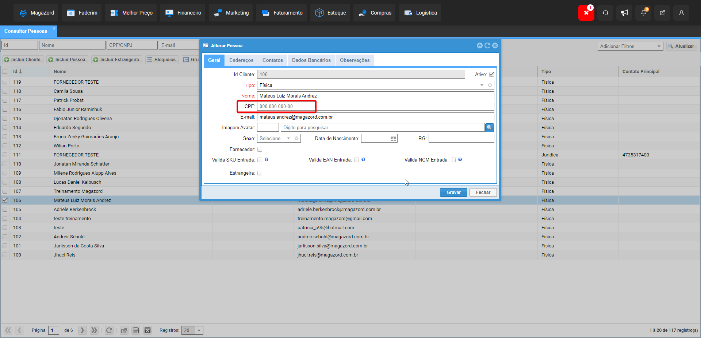

 

 
 

# Teste para vaga de Estágio em Analista de Qualidade no Magazord.com.br
Este repositório tem como fim testar os candidatos para vaga de estágio em analista de qualidade na empresa [Magazord](https://magazord.com.br).

## Teste:

Você está encarregado de testar a validação de dados cadastrais em um sistema de gerenciamento de usuários. O sistema possui os seguintes campos de cadastro:

- Nome completo
- E-mail
- Número de telefone
- Data de nascimento
- Endereço (com campos para rua, cidade, estado e CEP)

Houve alterações nos campos mencionados acima no cadastro do cliente, quais testes você faria para validar que o(s) campo(s) esta(ão) funcionando conforme esperado?

**Orientação:** Crie casos de teste para validar a entrada de dados nos campos modificados.

## Avaliação:

- Os candidatos serão avaliados com base na clareza, precisão e detalhamento das respostas.
- A capacidade de compreender e comunicar efetivamente requisitos e problemas é fundamental.
- A organização e a estrutura das respostas também serão consideradas na avaliação.

## Envio do teste:
Suba o repositório no seu Github e envie o link diretamente para o seu recrutador. Obs.: Não serão aceitos alterações após o envio.
